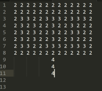

# Game Plan
## Austin Odell

### Breakout Variant: Super Breakout
I liked this variant because it kept to the simplicity and original style of the base game while adding in new power-ups and point drops. I also liked it because it seemed doable to be able to implement the features in this version. 

### General Level Descriptions
Code: 0-empty 1-normal 2-tough 3-indestructible 4-moving 
1. 
2. 
3. 
4. 
5. 

### Bricks Ideas
- Standard Bricks: Break in single collision
- Tough  Bricks: Take 5 collisions to break
- Indestructible bricks: Unlimited collision, don't need to be cleared to beat level.
- Moving Bricks: Move horizontally across the screen also tough (5 health) 
- Power up bricks (if needed)

### Power Up Ideas
Will try to have them just randomly come from bricks when broken, maybe at like 1/20 rate, if not then will make special single-hit power up bricks
1. Extra life
2. Slow ball
3. Grow paddle 
4. Shooting a laser out of the paddle
5. Sticky paddle. Ball sticks to paddle and can be moved and re-shot
6. (time permitting) Multi-ball - Add in additional balls, must have at least 1 to survive (can lose others at no life cost)
7. (time permitting) Point drops: Can gain extra points (or lose points) from collecting these

### Cheat Key Ideas
Game-play will be controlled using the arrow keys so other keys will be involved in cheat codes

- l: extra life
- b: extra ball
- 1-9: choose a level(1-4) or go to 5(bonus) for 5-9
- z: instant laser power-up
- (not sure on feasibility of multi-key cheats)  w-i-n instantly beats the game
- $: extra points 
- r: reset ball and paddle to start position

### Something Extra
Bonus points level: If you beat the game (finish level 5) then a bonus level pops up and you get to shoot the ball one time and then the paddle disappears. Will have to aim to get most bricks as possible to keep the ball bouncing around without going out. 

